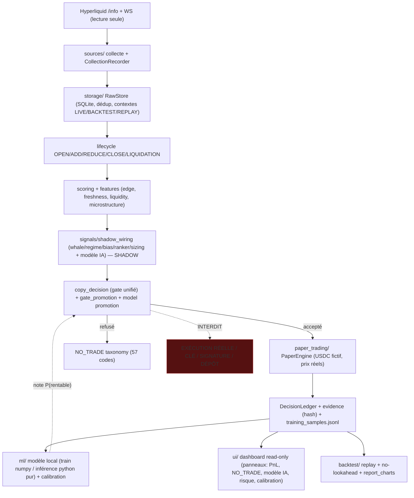

# CODEBASE_UML — architecture HyperSmart Observer (vue d'ensemble)

```mermaid
flowchart TD
    HL["Hyperliquid /info + WS (lecture seule)"] --> COL["sources/ collecte + CollectionRecorder"]
    COL --> RAW["storage/ RawStore (SQLite, dédup, contextes LIVE/BACKTEST/REPLAY)"]
    RAW --> LIFE["lifecycle OPEN/ADD/REDUCE/CLOSE/LIQUIDATION"]
    LIFE --> SCORE["scoring + features (edge, freshness, liquidity, microstructure)"]
    SCORE --> SHADOW["signals/shadow_wiring (whale/regime/bias/ranker/sizing + modèle IA) — SHADOW"]
    SHADOW --> GATE["copy_decision (gate unifié) + gate_promotion + model promotion"]
    GATE -->|accepté| PAPER["paper_trading/ PaperEngine (USDC fictif, prix réels)"]
    GATE -->|refusé| NT["NO_TRADE taxonomy (57 codes)"]
    PAPER --> LEDGER["DecisionLedger + evidence (hash) + training_samples.jsonl"]
    LEDGER --> ML["ml/ modèle local (train numpy / inférence python pur) + calibration"]
    ML -.note P(rentable).-> GATE
    LEDGER --> DASH["ui/ dashboard read-only (panneaux: PnL, NO_TRADE, modèle IA, risque, calibration)"]
    LEDGER --> BT["backtest/ replay + no-lookahead + report_charts"]

    classDef ban fill:#511,stroke:#a33;
    X["EXÉCUTION RÉELLE / CLÉ / SIGNATURE / DÉPÔT"]:::ban
    GATE -. INTERDIT .-> X
```

Règle transverse : aucune flèche ne mène à une action argent-réel. Tout est paper/lecture seule.
